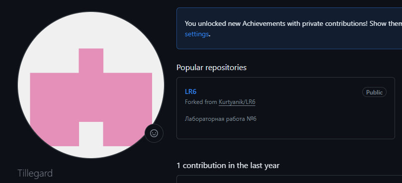

# Лабораторная работа №6

<h2 align="center"> Цель лабораторной работы</h2>
Изучение базовых возможностей системы управления версиями, опыт работы с Git Api, опыт работы с локальным и удаленным репозиторием.

<h2 align="center"> Ход выполнения работы</h2>

### 1. Создание аккаунта на сайте Github.

<h4 align="center">Рисунок 1 - Созданный аккаунт Github</h4>

### 2. Сделать копию в личное хранилище из https://github.com/Kurtyanik/LR6/ (Fork).

<h4 align="center">Рисунок 2 - Создание форка</h4>

### 3. Установить Git.

<h4 align="center">Рисунок 3 - Установленный Git</h4>

### 4. После установки настроить клиент git, введя имя пользователя (Группа Фамилия И.О.) и email.

<h4 align="center">Рисунок 4 - Настроенный при помощи команд `git config --global user.name` и `git config --global user.email` клиент Git</h4>

### 5. Клонировать свой личный удалённый репозиторий на компьютер.

<h4 align="center">Рисунок 5 - Клонирование репозитория на компьютер при помощи команды `git clone`</h4>

### 6. Добавить файл через интерфейс GitHub. Подтянуть изменения в локальный репозиторий.
.jpg)
<h4 align="center">Рисунок 6.1 - Добавление файла через интерфейс Github</h4>

.jpg)
<h4 align="center">Рисунок 6.2 - Подтягивание изменений при помощи команды `git pull`</h4>

### 7. Получить историю операций для каждой из веток.
.jpg)
<h4 align="center">Рисунок 7.1 - История операций ветки `master`, полученная при помощи команды `git log`</h4>

.jpg)
<h4 align="center">Рисунок 7.2 - История операций ветки `branch1`</h4>

### 8. Просмотреть последние изменения.

<h4 align="center">Рисунок 8 - Последние изменения, полученные через `git show`</h4>

### 9. Выполнить слияние в ветку master, разрешив конфликт.

<h4 align="center">Рисунок 9 - Разрешение конфликта и слияние в ветку `master`</h4>

### 10. Удалить побочную ветку после успешного слияния.

<h4 align="center">Рисунок 10 - Удаление ветки branch1 при помощи `git push origin --delete`</h4>

### 11. Сделать изменения и зафиксировать их, оставляя комментарии, несколько раз. 

<h4 align="center">Рисунок 11 - Добавление файлов и их фиксация при помощи команд `git add`, `git commit` и `git push`</h4>

### 12. Сделать откат коммита.

<h4 align="center">Рисунок 12 - Откат коммита при помощи команды `git reset --hard HEAD`</h4>

### 13. Создать ветку для отчёта. 

<h4 align="center">Рисунок 13 - Создание ветки `report` для отчета с помощью `git branch`</h4>

### 14. Начать оформлять отчёт в файле README.md.

<h4 align="center">Рисунок 14 - Написание отчёта</h4>

### 15. Получить историю операций в форматированном виде.

<h4 align="center">Рисунок 15 - История операций</h4>

### 16. Отправить локальные изменения в сетевое хранилище GitHub.

<h2 align="center"> Вывод </h2>
В ходе выполнения лабораторной работы были изученены базовые возможности системы управления версиями, получен опыт работы с Git Api и опыт работы с локальным и удаленным репозиторием.
